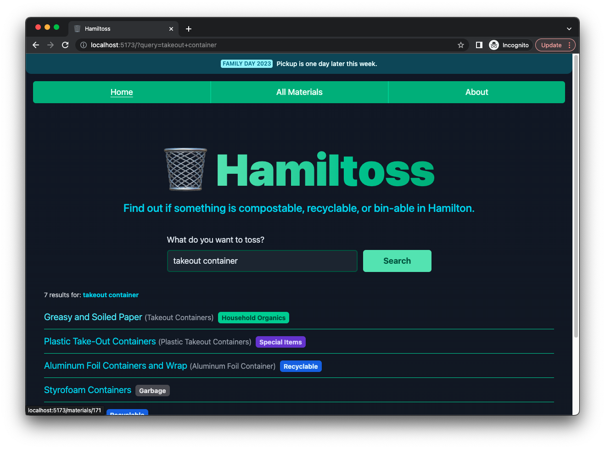

# 🗑 Hamiltoss

_Find out if something is recyclable in Hamilton_



Special thanks to Will for the name.

## Tech intro

This is a SvelteKit app made with their TypeScript starter

[Svelte Kit Docs](https://kit.svelte.dev/docs/introduction)

[Svelte Docs](https://svelte.dev/docs)

Styling is done with [Tailwind](https://tailwindcss.com/docs/installation) and was added to the project using this handy repo [svelte-add/tailwindcss](https://github.com/svelte-add/tailwindcss)

## Developing

You'll need at least `node 18`.

Once you've installed dependencies with `npm install`, start the development server:

```bash
npm run dev -- --open
```

The app will be running at

```
http://localhost:5173/
```

From there you can edit files, save them, and it'll update in the browser.

- Code is formatted with Prettier.
- I'm using the `prettier-plugin-tailwindcss` Prettier plugin to automatically sort tailwind classes in code.

## Deployment

- Deployed on netlify: https://hamiltoss.fyi/
  - Added `adapter-netlify` for this.
- Can run `npm run build` locally to check if the deloy will fail. Or just push and see.
  - You can preview the production build with `npm run preview`.
